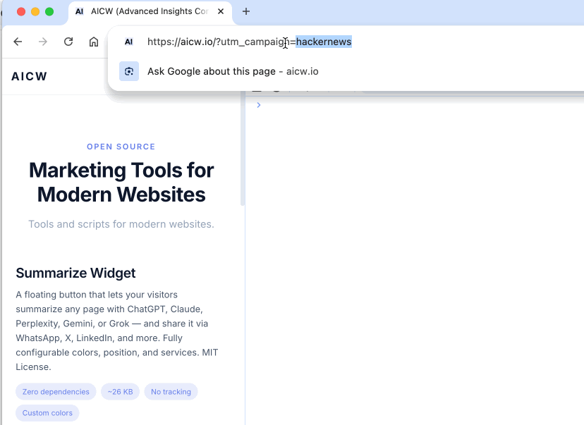

# AICW Params Saver

This script captures `utm_` params with values and adds them to internal links on the page. If a website visitor clicks on a link to go to another page on your website, `utm_` params will be preserved. 

**Example:**

- User visits this page: [www.aicw.io?utm_source=github](https://www.aicw.io?utm_source=github)
- Script automatically adds this `utm_source=github` param with value to all internal links on the page
- So link like `/aicw-summarize` becomes `/aicw-summarize?utm_source=github`
- Visitor clicks on this link [www.aicw.io/aicw-summarize?utm_source=github](www.aicw.io/aicw-summarize?utm_source=github)
- Until script is used on all pages, this `utm_source=github` will be preserved for visitor during the whole journey over your website

# Short Video Demo



## Quick Start

Add this to your HTML:

```html
<script src="https://cdn.jsdelivr.net/gh/aicw-io/aicw-params-saver@latest/dist/aicw-params-saver.min.js"></script>
```

That's it. This automatically:
- Captures UTM, Google Ads (gclid), Facebook (fbclid), Bing (msclkid), and ref params
- Stores them in localStorage (GDPR-compliant, no cookies)
- Decorates all internal links with the captured params

To pin to a specific release (recommended for production):

```html
<script src="https://cdn.jsdelivr.net/gh/aicw-io/aicw-params-saver@1.0.0/dist/aicw-params-saver.min.js"></script>
```

## What It Captures (Defaults)

| Pattern | Captures |
|---------|----------|
| `utm_` | utm_source, utm_medium, utm_campaign, utm_term, utm_content |
| `gclid` | Google Ads click ID |
| `fbclid` | Facebook click ID |
| `msclkid` | Microsoft/Bing Ads click ID |
| `ref` | Common referral parameter |

Links to your root domain and all subdomains are automatically decorated. For example, on `app.example.com`:
- `example.com` - decorated
- `app.example.com` - decorated
- `other.example.com` - decorated
- `different.com` - not decorated

## Configuration

Override defaults with data attributes on the script tag:

```html
<script
  src="https://cdn.jsdelivr.net/gh/aicw-io/aicw-params-saver@latest/dist/aicw-params-saver.min.js"
  data-params="utm_,gclid,custom_"
  data-storage="localStorage"
  data-merge-params="true"
  data-debug="true"
></script>
```

### Available Attributes

| Attribute | Type | Default | Description |
|-----------|------|---------|-------------|
| `data-params` | string | `utm_,gclid,fbclid,msclkid,ref` | Parameters to capture (startsWith matching, comma-separated) |
| `data-storage` | string | `localStorage` | Storage backend: `localStorage`, `sessionStorage`, `cookie`, or pipe-separated fallback (`cookie\|localStorage`) |
| `data-merge-params` | `true` \| `false` | `false` | Enable attribution journey tracking (see below) |
| `data-allowed-domains` | string | (auto-detect) | Domains for link decoration (comma-separated, supports `*.example.com`) |
| `data-exclude-patterns` | string | (see below) | URL patterns to skip (comma-separated) |
| `data-debug` | `true` \| `false` | `false` | Enable console logging |
| `data-config` | JSON | | Full config as JSON (individual attributes override) |

## JavaScript API

```javascript
// Get all captured parameters
ParamsSaver.getParams()
// Returns: { utm_source: "google", utm_medium: "cpc", gclid: "abc123" }

// Get a specific parameter
ParamsSaver.getParam("utm_source")
// Returns: "google" or null

// Clear all stored data
ParamsSaver.clear()
```

### Manual Initialization

```javascript
ParamsSaver.init({
  params: ["utm_", "gclid", "fbclid", "custom_"],
  storage: "localStorage",
  mergeParams: true,
  debug: true,
  onCapture: function(params, isFirstTouch) {
    console.log("Captured:", params, "First touch:", isFirstTouch);
  }
});
```

## Attribution Modes

### First-Touch (default)

With `data-merge-params="false"` (default), the original attribution is preserved forever:

```
Visit 1: ?utm_source=google    -> stored: "google"
Visit 2: ?utm_source=facebook  -> stored: "google" (unchanged)
Visit 3: ?utm_source=medium    -> stored: "google" (unchanged)
```

### Attribution Journey

With `data-merge-params="true"`, the full attribution journey is tracked:

```
Visit 1: ?utm_source=google    -> stored: "google"
Visit 2: ?utm_source=facebook  -> stored: "google|facebook"
Visit 3: ?utm_source=medium    -> stored: "google|facebook|medium"
Visit 4: ?utm_source=medium    -> stored: "google|facebook|medium" (no duplicates)
```

## Link Decoration

Internal links are automatically decorated with stored params. The decorator:
- Preserves existing query parameters (only adds missing ones)
- Preserves hash fragments (`#section`)
- Never overwrites existing param values

### Default Exclude Patterns

Links matching these patterns are NOT decorated:
- Executables: `*.exe`, `*.msi`, `*.dmg`, `*.pkg`
- Archives: `*.zip`, `*.rar`, `*.7z`
- Documents: `*.pdf`
- Protocols: `mailto:`, `tel:`, `javascript:`
- Pages: `*logout*`, `*signout*`, `*unsubscribe*`

### Excluding Specific Links

Add `data-pz-ignore` attribute or `pz-ignore` class:

```html
<a href="/logout" data-pz-ignore>Logout</a>
<a href="/admin" class="pz-ignore">Admin</a>
```

## Storage Options

**Default: localStorage (GDPR-compliant, no cookies)**

```html
<!-- localStorage only (default - GDPR-compliant) -->
<script src="..." data-storage="localStorage"></script>

<!-- sessionStorage only (clears on browser close) -->
<script src="..." data-storage="sessionStorage"></script>

<!-- Cookie with localStorage fallback (requires consent) -->
<script src="..." data-storage="cookie|localStorage"></script>

<!-- Cross-subdomain cookies: first allowed domain becomes cookie domain -->
<script src="..." data-storage="cookie|localStorage" data-allowed-domains=".example.com,partner.com"></script>
```

## SPA Support

The script automatically handles Single Page Applications:
- **MutationObserver** detects new links added dynamically and decorates them
- **History API hooks** intercept `pushState` and `replaceState` for navigation events
- **Popstate handler** handles browser back/forward buttons

No extra configuration needed.

## Examples

### Minimal (all defaults)

```html
<script src="https://cdn.jsdelivr.net/gh/aicw-io/aicw-params-saver@latest/dist/aicw-params-saver.min.js"></script>
```

### Custom parameters + attribution journey

```html
<script src="https://cdn.jsdelivr.net/gh/aicw-io/aicw-params-saver@latest/dist/aicw-params-saver.min.js"
  data-params="utm_,gclid,fbclid,ref,campaign_id"
  data-merge-params="true"
></script>
```

### Multi-domain with cookie storage

```html
<script src="https://cdn.jsdelivr.net/gh/aicw-io/aicw-params-saver@latest/dist/aicw-params-saver.min.js"
  data-storage="cookie|localStorage"
  data-allowed-domains=".example.com,partner.com"
></script>
```

### Debug mode with custom excludes

```html
<script src="https://cdn.jsdelivr.net/gh/aicw-io/aicw-params-saver@latest/dist/aicw-params-saver.min.js"
  data-debug="true"
  data-exclude-patterns="*.pdf,*logout*,*admin*,*.zip"
></script>
```

## Self-Hosting / Building

If you prefer to self-host instead of using the CDN:

```bash
git clone https://github.com/aicw-io/aicw-params-saver.git
cd aicw-params-saver
npm install
npm run build
```

Output files in `dist/`:
- `aicw-params-saver.js` — UMD build
- `aicw-params-saver.min.js` — minified UMD (use this for embedding)
- `aicw-params-saver.esm.js` — ES module build
- `aicw-params-saver.d.ts` — TypeScript declarations

### Run Tests

```bash
npm test
```

### Watch Mode

```bash
npm run build:watch
```

## Technical Details

- **Zero dependencies** at runtime — vanilla TypeScript compiled to ES2018
- **GDPR-compliant by default** — localStorage only, no cookies unless explicitly enabled
- **No third-party requests** — all data stays in the user's browser
- **SPA-ready** — MutationObserver + History API hooks for dynamic apps
- **Graceful fallback** — storage backends fall back in priority order

## Testing Links Decoration

- Open dev console in a web browser (`Cmd+Shift+I` or `Ctrl+Shift+I`)
- Copy paste and run the JS code below that will output all hovered links to the dev console:

```
window.addEventListener("mouseover", event => {
  const link = event.target.closest("a");
  if (link && link.href) {
    console.log("Hovered Link:", link.href);
  }
});
```

- in the same browser window open website with aicw params saver installed, use url with utm param added, for example: https://aicw.io?utm_campaign=github-aicw-params-saver
- move mouse over other links on the web page to see these links now all have `utm_campaign=github-aicw-params-saver` param and value added


## License

MIT - made by Eugene Mironichev [AICW.io](https://www.aicw.io)
